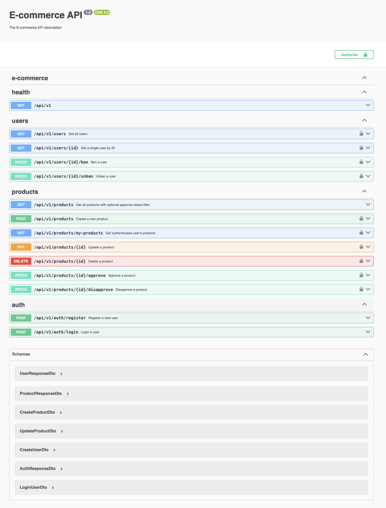

# Basic E-Commerce System

## Introduction

This project is part of the Techinnover Backend Take-Home Assessment. It involves developing a simple e-commerce system using NestJS. The application allows unauthenticated users to view approved products, authenticated users to manage their products, and an admin to manage users and products.

## Project Overview

The goal of this project is to demonstrate the ability to design, develop, and document a backend API. The application is built using the NestJS framework, leveraging a NOSQL database (MongoDB) for data persistence, and is designed with role-based access control for different user types.

## Technologies Used

- **NestJS:** A progressive Node.js framework for building efficient, scalable server-side applications.
- **TypeScript:** A strongly typed programming language that builds on JavaScript.
- **MongoDB:** A NoSQL database used for data persistence.
- **TypeORM:** An Object-Relational Mapping (ORM) library for TypeScript and JavaScript.
- **PassportJS:** Used for Authentication and Authorization.
- **Swagger:** Integrated for comprehensive API documentation.

## Features

1. **User Management:**
   - User registration and authentication (name, email, password).
   - Role-based access control (User, Admin).
   - Admins can view, ban, or unban users.
   - Banned users are restricted from logging in or interacting with the system.

2. **Product Management:**
   - Authenticated users can create, update, and delete their own products (name, price, description, quantity).
   - Admins can approve or disapprove products.
   - Only approved products are visible to unauthenticated users.
   - Unauthenticated users can browse approved products.

## Implementation Details

The project is implemented using NodeJS, NestJs, TypeScript, and Mongoose for database interactions. The chosen database is MongoDB.

## Getting Started

### Prerequisites

Ensure the following packages are installed locally:

1. [MongoDB](https://www.mongodb.com/try/download/community)
2. [Node (LTS Version)](https://nodejs.org)
3. [NPM](https://docs.npmjs.com/downloading-and-installing-node-js-and-npm)
4. NestJS CLI: `npm install @nestjs/cli -g`

### Setup Steps

1. **Clone the repo**

   ```bash
   git clone https://github.com/ChuloWay/ecommerce-api
   ```

2. **Create an env file:**

   - Duplicate the `.env.example` file in the project root.
   - Rename the duplicated file to `.env`.
   - Open the `.env` file and set your variables as shown in the example file.

   ```bash
   cp .env.example .env
   ```

   Ensure to fill in the necessary values in the `.env` file for a smooth configuration.

3. **Start your server:**

   ```bash
   npm run start:dev
   ```

## API Documentation

Explore the API documentation at -  [LOCALHOST] -- [Swagger](http://localhost:3000/api/v1/docs).




## Acknowledgements

Special thanks to:

- NestJS
- TypeScript
- MongoDB
- TypeORM
- Passport JS
- Websocket
- Swagger

## Conclusion
Thank you for exploring our Ecommerce System! Feel free to provide feedback, report issues, or contribute to the project. Happy managing!